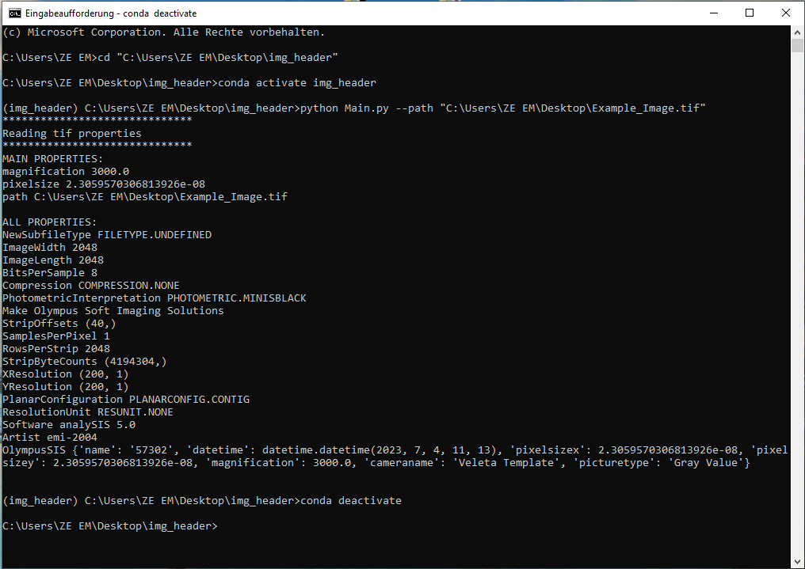

# img_header

## General information
img_header can be used for Jeol1400 images to read out tif properties like the pixelsize.
The pixelsize can be used for setting the scale in Fiji (ImageJ).

## Installation
### Anaconda
Install anaconda (for better version control). Therefore follow the instructions [here](https://docs.anaconda.com/free/anaconda/install/windows/). 
ATTENTION:: During installation, make sure to add Anaconda to your PATH variable. 

Generate a new python environment using anaconda. Inside a terminal type:
`conda create -n ENVNAME python=3.9` 
for example, you can name the environment `img_header` by creating an environment with
`conda create -n img_header python=3.9`
Next, you need to activate the conda environment by typing
`conda activate img_header`

### Install dependencies
Install pip inside the conda environment (this is a package manager for python packages)
`conda install pip`

Now, you are able to install all dependencies using pip. Therefore type:
`pip install -r requirements.txt`

Now you should be all setup to run the script by 
`python Main.py --path PATH_TO_IMG`

## Use img_header
1. Open Terminal
2. Open img_header. Example: If img_header is installed on desktop: cd "path to file"
Tipp: write cd, drag and drop img_header folder into Terminal
3. Activate conda: conda activate img_header
4. Read out tif properties: python Main.py --path "path to image"
Tipp: Drag and drop Jeol1400 image into Terminal instead of write path manual.
5. At the end deactivate conda: conda deactivate

## Example

## Use pixelsize in Fiji
1. Open Image in Fiji
2. Analyse - Set Scale: 
	Distance in pixels: 1
	Known distance: pixelsize from img_header in nm
	Unit of length: nm
3. Analyse - Tools - Scale bar